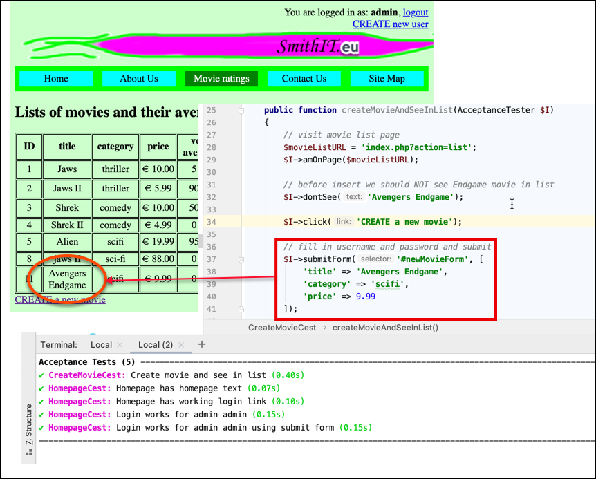

# evote-movie-2020-24-codeception-testing

Let's add some automated testing to the project. Let's test if we can login and create a new Movie.



- add the Codeception library to the project using Composer:

    ```bash
    composer req codeception/codeception
    ```

    - this should result in some libraries being added to the `/vendor` folder, plus a new `/tests` folder being created
    
- initialise the project for Codeception by running the bootstrapping command:
    
    ```bash
    php vendor\bin\codecept bootstrap
    ```
  
    - say "y (yes)" to any questions you are asked about composer install:
        
        ```bash
         Bootstrapping Codeception 
        
        File codeception.yml created       <- global configuration
         Adding codeception/module-phpbrowser for PhpBrowser to composer.json
         Adding codeception/module-asserts for Asserts to composer.json
        2 new packages added to require
        ? composer.json updated. Do you want to run "composer update"? (y/n) 
        
        say "y" here <<<<<<<
        
         Running composer update
        Loading composer repositories with package information
        Updating dependencies (including require-dev)
        Package operations: 9 installs, 2 updates, 0 removals
          - Updating symfony/polyfill-ctype (v1.14.0 => v1.15.0): Loading from cache
          - Updating symfony/polyfill-mbstring (v1.14.0 => v1.15.0): Loading from cache
          - Installing symfony/dom-crawler (v5.0.7): Loading from cache
          - Installing symfony/browser-kit (v5.0.7): Loading from cache
          - Installing codeception/lib-innerbrowser (1.3.1): Loading from cache
          - Installing guzzlehttp/promises (v1.3.1): Loading from cache
          - Installing symfony/polyfill-php72 (v1.15.0): Loading from cache
          - Installing symfony/polyfill-intl-idn (v1.15.0): Loading from cache
          - Installing guzzlehttp/guzzle (6.5.3): Downloading (100%)         
          - Installing codeception/module-phpbrowser (1.0.0): Loading from cache
          - Installing codeception/module-asserts (1.2.0): Downloading (100%)         
        symfony/browser-kit suggests installing symfony/process
        guzzlehttp/guzzle suggests installing psr/log (Required for using the Log middleware)
        codeception/module-phpbrowser suggests installing codeception/phpbuiltinserver (Start and stop PHP built-in web server for your tests)
        Writing lock file
        Generating autoload files
        12 packages you are using are looking for funding.
        Use the `composer fund` command to find out more!
         Unit helper has been created in tests/_support/Helper
         UnitTester actor has been created in tests/_support
         Actions have been loaded
        tests/unit created                 <- unit tests
        tests/unit.suite.yml written       <- unit tests suite configuration
         Functional helper has been created in tests/_support/Helper
         FunctionalTester actor has been created in tests/_support
         Actions have been loaded
        tests/functional created           <- functional tests
        tests/functional.suite.yml written <- functional tests suite configuration
         Acceptance helper has been created in tests/_support/Helper
         AcceptanceTester actor has been created in tests/_support
         Actions have been loaded
        tests/acceptance created           <- acceptance tests
        tests/acceptance.suite.yml written <- acceptance tests suite configuration
         --- 
        
         Codeception is installed for acceptance, functional, and unit testing 
        
        Next steps:
        1. Edit tests/acceptance.suite.yml to set url of your application. Change PhpBrowser to WebDriver to enable browser testing
        2. Edit tests/functional.suite.yml to enable a framework module. Remove this file if you don't use a framework
        3. Create your first acceptance tests using codecept g:cest acceptance First
        4. Write first test in tests/acceptance/FirstCest.php
        5. Run tests using: codecept run
        ```

- you now have:

    - new folder `tests`
    
    - new file `codeception.yml`
    
- we will work with 'acceptance' tests, simulating a user interacting with web pages (clicking links, filling in forms etc.)

    - so we need to set the "url" property of `tests/acceptance.suite.yml` to our  website URL if `localhost:8000`:
    
        ```yaml
        actor: AcceptanceTester
        modules:
            enabled:
                - PhpBrowser:
                    url: http://localhost:8000
                - \Helper\Acceptance
            step_decorators: ~        
        ```

- in one terminal window run the webserver: `php -S localhost:8000 -t public`

- in a second terminal window, run the tests with `php vendor\bin\codecept run` (there are none, but it checks things are working...):
    
    ```bash
    $ php vendor/bin/codecept run
  
    Codeception PHP Testing Framework v4.1.4
    Powered by PHPUnit 9.1.1 by Sebastian Bergmann and contributors.
    Running with seed: 
    
    Acceptance Tests (0) ------
    
    Functional Tests (0) -------
    
    Unit Tests (0) -----
    
    Time: 00:00.119, Memory: 10.00 MB
    
    No tests executed!
    ```

- NOTE: We can run **only** acceptance test by adding the word `acceptance` after `run`:

    ```bash
    php vendor/bin/codecept run acceptance
    ```

- let's create a test, to see if the home page has the text `Home Page`:

    - create a new Codeception test, with `php vendor\bin\codecept g:cest acceptance Homepage`
    
        ```bash
        $ php vendor/bin/codecept g:cest acceptance Homepage
      
        Test was created in /Users/matt/Downloads/24-codeception testging/tests/acceptance/HomepageCest.php
        ```

    - look at the class created `/tests/acceptance/HomepageCest.php`:
    
        ```php
        <?php 
        
        class HomepageCest
        {
            public function _before(AcceptanceTester $I)
            {
            }
        
            // tests
            public function tryToTest(AcceptanceTester $I)
            {
            }
        }
        ```
      
    - delete the first method `_before(...)` (we don't need it)
    
    - rename the second method `homepageHasHomepageText(...)` and add some statements to cvisit the home page and test for content:
    
        ```php
        <?php 
        class HomepageCest
        {
            public function homepageHasHomepageText(AcceptanceTester $I)
            {
                // visit website root
                $I->amOnPage('/');
        
                // we should see 'Home Page' text in a level-1 heading
                $I->see('Home Page', 'h1');
            }
        }
        ```

    - the test succeeds because our level 1 heading on the home page `Welcome to SmithIT Home Page` contains the text `Home Page`
    
        ```bash
        $ php vendor/bin/codecept run acceptance
        
        Codeception PHP Testing Framework v4.1.4
        Powered by PHPUnit 9.1.1 by Sebastian Bergmann and contributors.
        Running with seed: 
        
        Acceptance Tests (1) ---
        ✔ HomepageCest: Homepage has homepage text (0.08s)
        ----
        
        Time: 00:00.190, Memory: 12.00 MB
        
        OK (1 test, 1 assertion)
        ```
      
- let's add to our `HomepageCest` testing class a new method to test that from the home page there is a `login` link, succesfully leading to the login page, containing a level-1 heading with text `Login`:

    ```php
    public function homepageHasWorkingLoginLink(AcceptanceTester $I)
    {
        // visit website root
        $I->amOnPage('/');
    
        // click link for login
        $I->click('login');
    
        // should now be on login page URL
        $I->seeCurrentUrlEquals('/index.php?action=login');
    
        // we should see 'Login' text in a level-1 heading
        $I->see('Login', 'h1');
    }
    ```
  
- it is always a good idea to give each HTML form an ID, and also to give form buttons IDs - this avoids any ambiguity about what is being clicked (e.g. the link `login` vs the form button `login`). So let's add IDs to the form (`#loginForm`) and button (`#loginButton`) for our login form Twig template `/templates/loginForm.html.twig`:

    ```twig
    <form
            method="post"
            action="index.php"
            id="loginForm"
    >
        <input type="hidden" name="action" value="processLogin">
    
        username:
        <input name="username">
        <p>
            Password:
            <input name="password">
            <input type="submit" value="login" id="loginButton">
    </form>
    ```
  
- we can now add a testing method to enter username `admin` and password `admin`, and see the successful login text:

    ```php
    public function loginWorksForAdminAdmin(AcceptanceTester $I)
    {
        // visit website root
        $I->amOnPage('/index.php?action=login');
    
        // fill in username and password
        $I->fillField('username', 'admin');
        $I->fillField('password', 'admin');
    
        // click SUBMIT button
        $I->click('#loginButton');
    
        // we should see confirmation of login user name, and a logout link
        $I->see('You are logged in as: admin');
        $I->seeLink('logout');
    }
    ```
  
    - this works fine!
    
        ```bash
        $ php vendor/bin/codecept run acceptance
        
        Codeception PHP Testing Framework v4.1.4
        Powered by PHPUnit 9.1.1 by Sebastian Bergmann and contributors.
        Running with seed: 
        
        Acceptance Tests (3) -----
        ✔ HomepageCest: Homepage has homepage text (0.08s)
        ✔ HomepageCest: Homepage has working login link (0.10s)
        ✔ HomepageCest: Login works for admin admin (0.16s)
        ----------
        
        Time: 00:00.462, Memory: 12.00 MB
        
        OK (3 tests, 5 assertions)
        ```

- let's improve our test, confirming that we do NOT see the `You are logged in` message before we have logged in:

    ```php
    public function loginWorksForAdminAdmin(AcceptanceTester $I)
    {
        // visit website root
        $I->amOnPage('/index.php?action=login');
    
        // we should NOT see confirmation of login user name, and a logout link - before login
        $I->dontSee('You are logged in as: admin');
        $I->dontSeeLink('logout');
    
        // fill in username and password
        $I->fillField('username', 'admin');
        $I->fillField('password', 'admin');
    
        // click SUBMIT button
        $I->click('#loginButton');
    
        // we should see confirmation of login user name, and a logout link
        $I->see('You are logged in as: admin');
        $I->seeLink('logout');
    }
    ```

- NOTE: Another advantage of adding an ID for the form, it allows us to enter input values and submit all in one statement, with `$I->submitForm(<id>, [<values>])`:

    ```php
    public function loginWorksForAdminAdminUsingSubmitForm(AcceptanceTester $I)
    {
        // visit website root
        $I->amOnPage('/index.php?action=login');
    
        // we should NOT see confirmation of login user name, and a logout link - before login
        $I->dontSee('You are logged in as: admin');
        $I->dontSeeLink('logout');
    
        // fill in username and password and submit
        $I->submitForm('#loginForm', [
            'username' => 'admin',
            'password' => 'admin'
        ]);
    
        // we should see confirmation of login user name, and a logout link
        $I->see('You are logged in as: admin');
        $I->seeLink('logout');
    }
    ```
  
- we can now write a test to login, and create a new movie, and see it in the movie list. First, create a new testing class:

    ```bash
    $ php vendor/bin/codecept g:cest acceptance CreateMovie
    
    Test was created in /Users/matt/Downloads/24-codeception testging/tests/acceptance/CreateMovieCest.php
    ```

- this time we'll add some code in the `_before(...)` method - to login as `admin`:

```php
<?php 

class CreateMovieCest
{
    public function _before(AcceptanceTester $I)
    {
        // visit website root
        $I->amOnPage('/index.php?action=login');

        // we should NOT see confirmation of login user name, and a logout link - before login
        $I->dontSee('You are logged in as: admin');
        $I->dontSeeLink('logout');

        // fill in username and password and submit
        $I->submitForm('#loginForm', [
            'username' => 'admin',
            'password' => 'admin'
        ]);

        // we should see confirmation of login user name, and a logout link
        $I->see('You are logged in as: admin');
        $I->seeLink('logout');
    }

    ... our testing method to go here ...
}
```

- let's add ID `#newMovieForm` to our new movie form in `/templates/newMovieForm.html.twig`:

```twig
    <form action="/" method="post" id="newMovieForm">
        <input type="hidden" name="action" value="processNewMovie">

        <p>
            Title:
            <input name="title" value="{{ title }}">
        <p>
            Category:
            <input name="category" value="{{ category }}">
        <p>
            Price:
            <input name="price" value="{{ price }}">
        <p>
            <input type="submit">
    </form>
```

- we can now write our create movie test method, assuming the `_before(...)` method has already logged us in as an administrator:
    
    ```php
    public function createMovieAndSeeInList(AcceptanceTester $I)
    {
        // visit movie list page
        $movieListURL = 'index.php?action=list';
        $I->amOnPage($movieListURL);
    
        // before insert we should NOT see Endgame movie in list
        $I->dontSee('Avengers Endgame');
    
        $I->click('CREATE a new movie');
    
        // fill in username and password and submit
        $I->submitForm('#newMovieForm', [
            'title' => 'Avengers Endgame',
            'category' => 'scifi',
            'price' => 9.99
        ]);
    
        // we should now see Endgame movie in list
        $I->see('Avengers Endgame');
    }
    ```
  
    - it all works fine:
            
        ```bash
        php vendor/bin/codecept run acceptance
        Codeception PHP Testing Framework v4.1.4
        Powered by PHPUnit 9.1.1 by Sebastian Bergmann and contributors.
        Running with seed: 
        
        Acceptance Tests (5) --------
        ✔ CreateMovieCest: Create movie and see in list (0.40s)
        ✔ HomepageCest: Homepage has homepage text (0.07s)
        ✔ HomepageCest: Homepage has working login link (0.10s)
        ✔ HomepageCest: Login works for admin admin (0.15s)
        ✔ HomepageCest: Login works for admin admin using submit form (0.15s)
        -------------
        
        Time: 00:00.963, Memory: 12.00 MB
        
        OK (5 tests, 14 assertions)
        ```

